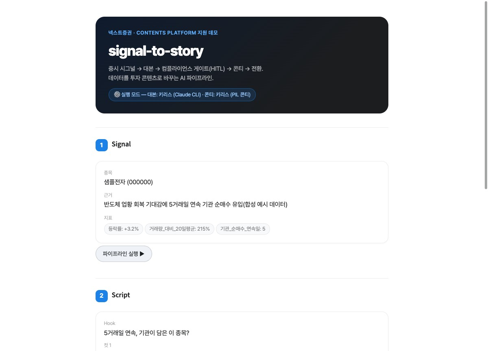
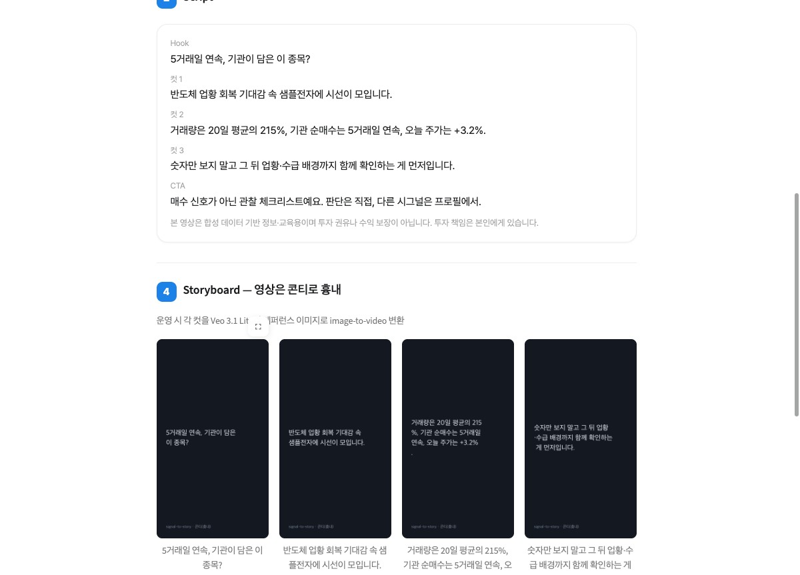

# signal-to-story

> 증시 시그널을 숏폼 투자 콘텐츠로 바꾸는 AI 파이프라인 데모 · 넥스트증권 Product Manager(Contents Platform) 지원용

## 한 줄 요약

증시 시그널 한 건을 받아 대본 생성, 자본시장법 컴플라이언스 검수, 사람 승인 게이트, 콘티, 전환 설계까지 다섯 단계를 하나의 파이프라인으로 연결했습니다. 넥스트증권 콘텐츠 플랫폼이 지향하는 "증시 데이터 → LLM 원고 → 숏폼 영상 자동 생산" 구조를 작게 직접 복제한 것입니다. 말로 설명하는 대신 돌아가는 코드로 보여드리려 만들었습니다.

API 키가 없어도 로컬 `claude` CLI로 즉시 실행됩니다(아래 키리스 모드).



## 1. 배경

증권사 콘텐츠 플랫폼의 핵심 과제는 데이터가 있어도 콘텐츠가 늦게 나온다는 점입니다. 기관 순매수 신호가 뜨는 순간부터 유저가 15초 숏폼으로 그 맥락을 소화하기까지, 편집과 자막과 규제 검수와 배포 사이클이 수 시간에서 수일을 잡아먹습니다.

이 병목을 데이터에서 콘텐츠까지 자동으로 흐르는 라인으로 풀면 어떻게 되는지 직접 확인하려고 그 구조를 작게 만들어 보았습니다.

## 2. 파이프라인 (5단계)

```
Signal → Script → Compliance Gate (HITL) → Storyboard → Conversion
```

| 단계 | 파일 | 역할 |
|------|------|------|
| 1. Signal | `pipeline/stage1_signal.py` | `data/sample_signal.json`(합성 데이터)을 로드해 종목·근거·지표를 `Signal` 객체로 구조화 |
| 2. Script | `pipeline/stage2_script.py` | Claude가 15초 숏폼 대본(hook + 3컷 + CTA)을 생성. `prompts/script.md`에 자본시장법 준수 템플릿(수익보장·단정적 매수권유·과장 금지, 면책 1줄) 내재화 |
| 3. Compliance Gate | `pipeline/stage3_compliance.py` | Claude가 대본의 자본시장법 위험 표현을 플래그. `high` 심각도가 하나라도 있으면 `ComplianceReport.passed = False`. Streamlit에서 사람이 승인·반려를 눌러야 다음 단계로 진행 |
| 4. Storyboard | `pipeline/stage4_storyboard.py` | 이미지 모델이 콘티 프레임 4장(hook + 3컷)을 생성. 영상은 이 콘티 단계까지 흉내이며, 운영 시 각 프레임이 Veo 3.1 Lite(image-to-video)로 넘어가는 설계 |
| 5. Conversion | `pipeline/stage5_conversion.py` | CTA, 딥링크(UTM 포함), Watchtime·CTR·Conversion 지표 정의(목업 수치)를 설계. 조회수가 아니라 앱 내 전환을 끝점으로 둠 |

오케스트레이션은 `pipeline/orchestrator.py`의 `Pipeline` 클래스가 맡습니다. 상태(`INIT → AWAITING_APPROVAL → APPROVED/REJECTED → DONE`)를 관리하고, Streamlit(`app.py`)이 시각 껍데기로 감쌉니다.

사람 승인 이후 콘티 4컷과 전환 설계가 펼쳐지는 화면입니다.



## 3. 도구 위임 결정

Claude가 모든 단계를 혼자 처리하지 않는다는 것이 이 설계의 핵심 원칙입니다. 모달리티마다 현재 가장 강한 모델에 위임해 품질을 확보하고, Python은 이들을 잇는 글루 코드만 맡습니다. PM이 잡아야 할 것은 도구 자체가 아니라 데이터에서 대본, 품질 게이트로 이어지는 판단 로직이라고 보았습니다.

| 역할 | 선택 | 이유 |
|------|------|------|
| 대본·컴플라이언스 | Claude | 한국어 금융 텍스트 생성과 규제 리스크 판단 |
| 콘티 이미지 | OpenAI GPT Image (`gpt-image-1`) | 2026.6 이미지 아레나 상위권, 지시 이해 정확 |
| 영상화 | Veo 3.1 Lite (설계만) | 9:16 비율·네이티브 음성·image-to-video·저비용 |
| 음성 | Supertone (스코프 밖) | 한국어 TTS는 토종 특화 모델이 우위 |
| 글루 | Python | 재현·버전관리·직접 빌드 증거 |

상세 배경은 [docs/decisions.md](docs/decisions.md)에 있습니다.

## 4. 전환(Conversion)

증권사에서 콘텐츠의 끝점은 조회수가 아니라 앱 내 전환입니다. 15초 숏폼이 아무리 잘 나와도 유저가 해당 종목 상세 화면까지 들어와야 비즈니스 가치가 생깁니다. 그래서 콘텐츠 품질만 보지 않고 전환 퍼널 전체를 설계해 코드로 표현했습니다.

Stage 5가 설계하는 항목입니다.

- CTA: `{종목명} 상세 보기 →` 형태로 영상 마지막 프레임에 오버레이
- 딥링크: `nextsec://stock/{ticker}?utm_source=shorts&utm_campaign=signal_demo`, 앱 직접 진입과 UTM 캠페인 추적
- 추적 지표(목업): Watchtime(목표 ≥ 7초/15초), CTR(목표 ≥ 4%), Conversion(클릭에서 앱 내 종목 상세 진입, 딥링크와 UTM으로 추적)

## 5. 실행

```bash
# 의존성 설치
uv sync --group dev

# 테스트 (API 키 불필요, 외부 I/O는 Fake 클라이언트로 목킹)
uv run pytest -q
# → 20 passed
```

### 키 없이 즉시 실행 (키리스 모드)

API 키가 없어도 바로 실행됩니다.

```bash
uv run streamlit run app.py
```

`ANTHROPIC_API_KEY`와 `OPENAI_API_KEY` 환경 변수가 없으면 앱이 자동으로 키리스 모드로 전환됩니다.

| 역할 | 키 있을 때 | 키 없을 때 |
|------|-----------|-----------|
| 대본 생성 | Anthropic API (Claude) | 로컬 `claude` CLI (`claude -p`) |
| 콘티 이미지 | OpenAI GPT Image | PIL 캡션 카드(720×1280 흉내 카드) |

대본은 로컬에 설치된 Claude Code의 `claude` CLI를 헤드리스로 호출합니다. Claude Code 구독이 있으면 별도 API 결제 없이 동작합니다. 콘티는 PIL로 720×1280 카드에 장면 텍스트를 렌더링한 것으로, 실제 이미지 생성이 아니라 구조 확인용 흉내임을 화면에 명시합니다. 키를 설정하면 실제 API로 자동 전환되고, 앱 상단에 현재 실행 모드가 표시됩니다.

## 6. 스코프와 한계

정직하게 적습니다.

실제로 하는 것

- 합성 시그널에서 대본 생성, 자본시장법 컴플라이언스 검수, 사람 승인 게이트, 콘티 4장, 전환 지표 설계까지 전체 파이프라인을 코드로 연결합니다.
- 테스트 20개가 외부 API 없이 로컬에서 통과합니다.

하지 않는 것(확장안)

- 실제 영상 렌더링: Veo 3.1 Lite 연동은 설계 수준이고, 콘티 4장으로 흉내냅니다.
- Supertone TTS: 음성 합성은 스코프 밖입니다.
- 실시간 데이터 연동: 현재는 `data/sample_signal.json` 합성 데이터를 씁니다.
- 다종목 대량 생산: 단일 시그널, 단일 콘텐츠 데모입니다.
- 자동 배포: 유튜브 쇼츠·인스타 릴스 등 플랫폼 업로드 연동은 없습니다.
